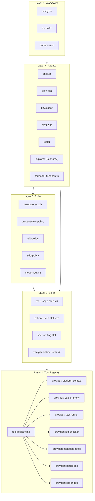
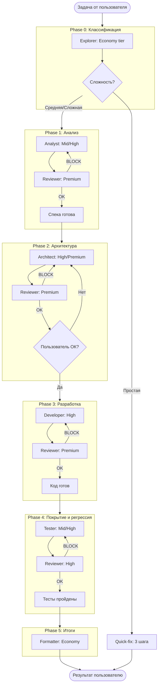

# SPEC-001: Модульный фреймворк агентной разработки на 1С (BSL)

Status: Draft → Review (iteration 1 complete)
Date: 2026-02-11
Author: Human + AI collaborative design
Reviewers: GPT 5.2 (feedback), Opus 4.6 (analysis + fixes)

---

## Context and Problem Statement

Платформа 1С:Предприятие — закрытая экосистема. LLM-агент не может напрямую работать с метаданными, проверять синтаксис, запускать тесты или анализировать логи. Для этого нужны MCP-серверы (Model Context Protocol), каждый из которых предоставляет набор tool-ов.

Существующие решения (comol/cursor_rules_1c, AndreevED/1c-ai-feature-dev-workflow, rmartynenko/workflow-dev-1c-claude-code, Nikolay-Shirokov/cc-1c-skills) решают эту проблему, но с ограничениями:

- **comol**: завязан на платные MCP-серверы (vibecoding1c.ru), без них половина правил бесполезна
- **AndreevED**: хорошая структура воркфлоу, но тонкие coding standards (30 строк) и минимальная MCP-документация
- **rmartynenko**: перегружен Memory Bank, трекерами и enterprise overhead; много AI-сгенерированного шаблонного контента
- **Nikolay-Shirokov**: оригинальный JSON DSL для XML-генерации, но Windows-only и ограничен EPF/ERF

Ни одно из решений не предлагает:
1. Возможность замены MCP-сервера без переписывания правил
2. Кросс-ревью между агентами на каждом шаге
3. Экономию на токенах через tier-инг моделей
4. Стандартизированный формат спецификаций
5. TDD-подход с интегрированным тест-планом

**Пользователи:** разработчики 1С, использующие AI-агенты (Cursor, Claude Code, другие IDE) для написания кода на BSL.

---

## Requirements (RFC 2119)

### MVP (v0.1) — минимальный рабочий набор

MVP считается достигнутым когда:
- Есть capability contracts для core-набора (search, check, test, navigate)
- Есть 3+ provider profile с матрицей совместимости
- Есть 1 рабочий адаптер (Cursor) с bootstrap
- Есть демонстрационный сценарий quick-fix и full-cycle с артефактами
- BSL coding standards и антипаттерны оформлены и работают

Требования ниже помечены `[MVP]` если входят в v0.1, иначе — v0.2+.

### MUST (обязательно — без этого задача не решена)

1. `[MVP]` Фреймворк MUST быть модульным ("кубики конструктора") — каждый навык, правило, агент — отдельный файл, подключаемый независимо
2. `[MVP]` Фреймворк MUST поддерживать замену MCP-сервера через изменение одного provider profile при условии совместимости capability contracts; несовместимость MUST быть явно отражена в матрице совместимости
3. `[MVP]` Каждая capability в tool-registry MUST иметь описанный контракт: входные параметры, формат результата, типичные ошибки
4. `[MVP]` Фреймворк MUST включать навыки, объясняющие агенту назначение каждого tool и примеры работы с ним
5. `[MVP]` Фреймворк MUST включать правила обязательного использования tool-ов когда утверждение проверяемо и есть риск ошибки; если capability недоступен — агент MUST зафиксировать причину пропуска
6. Фреймворк MUST поддерживать кросс-ревью: в детерминированном режиме всё, что сгенерировал один агент, проверяется другим агентом (см. Review Gating)
7. Ревьюер MUST видеть цель/задачу генератора и оценивать артефакт против цели, используя чек-лист для соответствующего типа артефакта
8. Фреймворк MUST включать описания ролей агентов (аналитик, архитектор, разработчик, ревьюер, тестировщик) как протоколы: входы, выходы, ответственность
9. `[MVP]` Фреймворк MUST содержать стандарт спецификации на основе проверенных практик (MADR 4.0, RFC 2119, ADR)
10. `[MVP]` Фреймворк MUST содержать BSL best practices (coding standards, антипаттерны, паттерны запросов) с объяснением ПОЧЕМУ, а не просто "плохо/хорошо"
11. `[MVP]` Ядро фреймворка (протоколы, контракты, навыки, best practices) MUST быть IDE-agnostic — чистый markdown. Исполнимые механизмы (суб-агенты, model routing, workflow orchestration) — часть IDE-адаптеров
12. `[MVP]` Фреймворк MUST поддерживать SDD (Spec-Driven Development) и TDD (Test-Driven Development)
13. Тесты, написанные тестировщиком, MUST проверяться ревьюером на полноту покрытия и корректность

### SHOULD (желательно — значительно улучшает решение)

1. Фреймворк SHOULD поддерживать два режима: детерминированный (жёсткие фазы с обязательным кросс-ревью) и свободный (навыки + правила без фаз, кросс-ревью опционально)
2. Фреймворк SHOULD включать model-routing — правила выбора модели по tier-у задачи для экономии токенов
3. Фреймворк SHOULD включать economy-агентов для простых задач (исследование кода, форматирование) на дешёвых моделях
4. Фреймворк SHOULD включать навыки XML-генерации (JSON DSL → Form.xml) кроссплатформенно (Windows + Linux)
5. Ревью SHOULD ограничиваться 3 итерациями с эскалацией пользователю при нерешённых BLOCK-замечаниях
6. Фреймворк SHOULD включать quick-fix воркфлоу (3 шага) для простых задач
7. Документация фреймворка SHOULD быть на русском языке (контент), структура файлов — на английском

### MAY (опционально — nice to have)

1. Фреймворк MAY включать навыки работы с логами (ЖР, ТЖ) через MCP
2. Фреймворк MAY поддерживать PMBOK-lite процессы для сложных задач
3. Фреймворк MAY включать BABOK-lite подход для стадии анализа
4. Фреймворк MAY включать минимальный threat model: запрет на секреты в контексте, правила маскировки ПД в логах

### MUST NOT (явные запреты)

1. Фреймворк MUST NOT зависеть от платных MCP-серверов
2. Фреймворк MUST NOT использовать Memory Bank, TaskMaster или аналогичные системы управления контекстом, забивающие контекстное окно
3. Фреймворк MUST NOT дублировать развёрнутый контент между файлами — навыки/правила ссылаются друг на друга; допускаются краткие сводные таблицы со ссылкой на source of truth
4. Фреймворк MUST NOT быть привязан к конкретной IDE (Cursor, Claude Code, etc.) на уровне ядра
5. Правила и навыки MUST NOT содержать конкретные имена MCP-tool-ов — только абстрактные capability через tool-registry

---

## Scope

### In scope

- Реестр инструментов (tool-registry) с capability contracts и абстракцией над MCP-серверами
- Provider profiles для 7 open-source MCP-серверов:
  1. `platform-context` — [alkoleft/mcp-bsl-platform-context](https://github.com/alkoleft/mcp-bsl-platform-context) (API платформы)
  2. `copilot-proxy` — [SteelMorgan/spring-mcp-1c-copilot](https://github.com/SteelMorgan/spring-mcp-1c-copilot) (AI-ассистент 1С)
  3. `test-runner` — [alkoleft/mcp-onec-test-runner](https://github.com/alkoleft/mcp-onec-test-runner) (тесты, сборка, синтаксис)
  4. `log-checker` — [SteelMorgan/1c-log-checker](https://github.com/SteelMorgan/1c-log-checker) (ЖР, ТЖ)
  5. `metadata-tools` — [RooLee10/1c-mcp-tools](https://github.com/RooLee10/1c-mcp-tools) (метаданные, запросы к БД, навигационные ссылки — 6 tool-ов + 1 ресурс)
  6. `batch-ops` — [vladimir-kharin/1c-batch](https://github.com/vladimir-kharin/1c-batch) (сборка/разборка)
  7. `lsp-bridge` — mcp-bsl-lsp-bridge (навигация по коду, диагностика)
- 6 навыков по использованию инструментов
- 6 навыков по BSL best practices
- Стандарт спецификации (SDD)
- Навыки XML-генерации (опционально)
- 5 правил (mandatory-tools, cross-review, TDD, SDD, model-routing)
- 5 описаний ролей агентов + 2 economy-роли (протоколы в ядре)
- 3 воркфлоу (full-cycle, quick-fix, orchestrator)
- Конфигурация проекта
- Адаптер для Cursor IDE (первый, остальные — v0.2+)

### Out of scope

- Реализация MCP-серверов (они уже существуют, мы только документируем их tool-ы)
- Интеграция с трекерами задач (Jira, Yougile, GitHub Issues)
- Memory Bank и системы управления контекстом между сессиями
- Автоматические тесты самого фреймворка (это markdown-документы, не код)
- Генерация объектов метаданных 1С (создаёт пользователь вручную в Конфигураторе/EDT)

### Протокол "агент ↔ пользователь" для метаданных

Агент не может создавать объекты метаданных 1С. Когда агенту нужен новый объект:

1. **Агент формирует инструкцию** — конкретный список: тип объекта, имя, реквизиты, табличные части, типы данных
2. **Агент блокирует работу** и ждёт подтверждения пользователя (фаза помечается `WAITING_USER`)
3. **Пользователь создаёт объект** в Конфигураторе/EDT и подтверждает готовность
4. **Агент продолжает** — проверяет наличие объекта через `search_metadata` и пишет код модулей

---

## Considered Options

### Архитектура tool-registry

1. **Прямые ссылки на MCP-tool-ы в навыках** (как у comol) — проще, но при замене MCP переписывать 15+ файлов
2. **Двухуровневая абстракция: capability → provider** — сложнее на старте, но замена MCP = один файл
3. **Runtime-переименование tool-ов** — невозможно технически, MCP-протокол фиксирует имена

### Формат спецификации

1. **Свой формат с нуля** — гибко, но нет доказательной базы и признания
2. **MADR 4.0 + RFC 2119 + ADR** — проверенные стандарты, используются в крупных проектах
3. **OpenSpec** — тяжёлый, избыточный для наших задач

### Кросс-ревью

1. **Confidence scoring 0-100** (как у comol) — красиво, но нет доказательств эффективности, сложно калибровать
2. **BLOCK/WARN/INFO уровни** — просто, однозначно, actionable
3. **Без формальной системы** (как у AndreevED) — ревью есть, но нет формата замечаний

### Model routing

1. **Одна модель на всё** — просто, но дорого
2. **Tier-ы Economy/Mid/High/Premium** — оптимизация cost/quality
3. **Динамический выбор по сложности** — слишком сложно для первой версии

---

## Decision Outcome

| Решение | Выбор | Обоснование |
|---------|-------|-------------|
| Tool-registry | Вариант 2: двухуровневая абстракция | Ключевое требование — замена MCP без переписывания. Стоимость: один дополнительный слой файлов |
| Формат спеки | Вариант 2: MADR 4.0 + RFC 2119 + ADR | Проверенные стандарты, не изобретение. MADR используется в Wikimedia, CERT/CC |
| Кросс-ревью | Вариант 2: BLOCK/WARN/INFO | Простота и однозначность. Confidence scoring — overhead без доказанной пользы |
| Model routing | Вариант 2: Tier-ы | Экономия 10-50x на простых задачах. Grok ($0.20/1M) vs Opus ($15/1M) |

### Consequences

**Good:**
- Замена MCP-сервера = изменение одного provider-файла
- Экономия на токенах через tier-инг моделей
- Кросс-ревью ловит ошибки до того, как они попадут к пользователю
- Стандартизированные спеки читаемы и ревьюируемы
- Модульность позволяет использовать только нужные "кубики"

**Bad:**
- Tool-registry — дополнительный уровень индирекции (усложнение)
- Кросс-ревью увеличивает стоимость и время (до 3x на каждую фазу)
- Tier-инг моделей требует поддержки актуальности (модели обновляются)
- Универсальный markdown может потерять IDE-специфичные фичи (.mdc metadata, .claude/ hooks)

---

## Technical Design

### Архитектура (5 слоёв)



### Структура каталогов

```
1c-agent-based-dev-framework/
├── docs/                              # Исследования и спецификации
│   ├── SPEC-001-framework-architecture.md  # Этот документ
│   ├── model-capabilities.md          # Tier-ы моделей, бенчмарки, цены
│   ├── mcp-inventory.md               # Полный инвентарь MCP-инструментов
│   └── sources-analysis.md            # Критический анализ референсных репо
│
├── .cursor/                           # Адаптер для Cursor IDE
│   ├── rules/bootstrap.mdc
│   ├── skills/
│   └── agents/
│
├── framework/                         # Ядро (IDE-agnostic markdown)
│   ├── tool-registry/                 # Слой 1
│   │   ├── tool-registry.md
│   │   ├── providers/ (7 файлов + шаблон)
│   │   └── _template-provider.md
│   │
│   ├── skills/                        # Слой 2
│   │   ├── tool-usage/ (6 файлов)
│   │   ├── bsl-practices/ (6 файлов)
│   │   ├── spec-writing/spec-standard.md
│   │   └── xml-generation/ (2 файла, опционально)
│   │
│   ├── rules/ (5 файлов)             # Слой 3
│   ├── agents/ (7 файлов + шаблон)   # Слой 4
│   ├── workflows/ (3 файла)          # Слой 5
│   └── config.md
│
└── README.md
```

### Терминология

| Термин | Значение |
|--------|----------|
| **MCP server** | Конкретный сервер (репо, версия, endpoint). Пример: `alkoleft/mcp-bsl-platform-context v1.2` |
| **Provider profile** | Файл-маппинг: какие capability реализует данный MCP server, через какие tool-ы, с какими параметрами |
| **Capability** | Абстрактная возможность фреймворка (например, `check_syntax`). Не зависит от конкретного MCP server |
| **Capability contract** | Описание интерфейса capability: входные параметры, формат результата, ошибки |

### Capability Contracts (core)

Каждая capability описывается контрактом. Provider profile обязан реализовать контракт или явно указать ограничения.

**Формат контракта (в `tool-registry.md`):**

```markdown
#### check_syntax
Категория: Core (MUST)
Описание: Проверка синтаксиса BSL-модуля или конфигурации

Входные параметры:
- target (string, REQUIRED) — путь к модулю или "all" для всей конфигурации
- mode (string, OPTIONAL) — "edt" | "designer", default: "edt"

Результат:
- success (boolean) — проверка пройдена без ошибок
- errors (array) — [{file, line, message, severity}]
- warnings (array) — [{file, line, message}]

Типичные ошибки:
- Сервер недоступен → capability помечается unavailable
- Таймаут на больших конфигурациях → увеличить timeout в config

Побочные эффекты: нет (read-only)
```

**Категории capability:**

| Категория | Capability | Описание |
|-----------|-----------|----------|
| **Core (MUST)** | `search_platform_api`, `check_syntax`, `run_tests`, `navigate_symbol`, `get_diagnostics` | Без них фреймворк не функционален |
| **Important (SHOULD)** | `get_type_info`, `build_project`, `search_metadata`, `rename_symbol`, `get_call_graph`, `ask_ai_assistant` | Деградация качества, но работать можно |
| **Optional (MAY)** | `search_event_log`, `search_tech_log`, `configure_tech_log`, `dump_config`, `launch_app`, `get_code_actions`, `search_templates`, `search_ssl_functions` | Дополнительные возможности |

### Capability → Provider маппинг

| Capability | Кат. | Provider profile | Конкретный tool в MCP |
|------------|------|------------------|-----------------------|
| `search_platform_api` | Core | platform-context | `search` |
| `get_type_info` | Imp. | platform-context | `info` / `getMembers` / `getConstructors` |
| `check_syntax` | Core | test-runner | `check_syntax_edt` (default) |
| `run_tests` | Core | test-runner | `run_all_tests` / `run_module_tests` |
| `build_project` | Imp. | test-runner | `build_project` |
| `dump_config` | Opt. | test-runner | `dump_config` |
| `launch_app` | Opt. | test-runner | `launch_app` |
| `search_event_log` | Opt. | log-checker | `logc_get_event_log` |
| `search_tech_log` | Opt. | log-checker | `logc_get_tech_log` |
| `configure_tech_log` | Opt. | log-checker | `logc_configure_techlog` / `logc_save_techlog` / ... |
| `search_metadata` | Imp. | metadata-tools | `list_metadata_objects` / `get_metadata_structure` |
| `execute_query` | Opt. | metadata-tools | `execute_query` |
| `validate_query` | Opt. | metadata-tools | `validate_query` |
| `resolve_nav_link` | Opt. | metadata-tools | `parse_nav_link` / `get_nav_link` |
| `navigate_symbol` | Core | lsp-bridge | `definition` / `symbol_explore` / `hover` |
| `rename_symbol` | Imp. | lsp-bridge | `rename` |
| `get_diagnostics` | Core | lsp-bridge | `document_diagnostics` |
| `get_call_graph` | Imp. | lsp-bridge | `call_hierarchy` / `call_graph` |
| `get_code_actions` | Opt. | lsp-bridge | `code_actions` |
| `ask_ai_assistant` | Imp. | copilot-proxy | `ask_1c_ai` |
| `search_templates` | Opt. | copilot-proxy | `ask_1c_ai` (промпт: "найди пример...") |
| `search_ssl_functions` | Opt. | lsp-bridge → copilot-proxy (fallback) | `symbol_explore` → `ask_1c_ai` |

### Матрица совместимости (Capability × Provider)

> Полная матрица — в `docs/mcp-inventory.md`. Здесь — сводка.

| Provider profile | Core caps | Important caps | Optional caps | Статус |
|------------------|-----------|----------------|---------------|--------|
| platform-context | 1/5 | 1/6 | 0/8 | Частичный |
| test-runner | 2/5 | 1/6 | 2/8 | Частичный |
| lsp-bridge | 2/5 | 3/6 | 1/8 | Основной |
| copilot-proxy | 0/5 | 1/6 | 2/8 | Вспомогательный |
| log-checker | 0/5 | 0/6 | 3/8 | Опциональный |
| metadata-tools | 0/5 | 1/6 | 3/11 | Частичный — метаданные, запросы, навигационные ссылки |
| batch-ops | 0/5 | 0/6 | 0/8 | Утилитарный |

### Tier-ы моделей (принцип)

Фреймворк использует 4 tier-а моделей: **Economy → Mid → High → Premium**. Конкретные модели, цены и бенчмарки — в [`docs/model-capabilities.md`](model-capabilities.md).

**Правила маршрутизации:**
- Если задачу можно поручить более дешёвой модели без снижения качества — ОБЯЗАТЕЛЬНО поручить ей
- Explorer (исследование кода) — всегда Economy (grep + LSP = детерминированный результат)
- Ревьюер НЕ должен быть слабее автора (tier ≥ tier автора)
- Финальный ревью перед пользователем — всегда Premium

### Workflow: Full Cycle (детерминированный)



### Кросс-ревью: протокол

```
Вход ревьюера:
  1. [TASK]: Описание задачи / цели
  2. [SPEC]: Спецификация (если есть)
  3. [ARTIFACT]: Артефакт для проверки
  4. [CHECKLIST]: Чек-лист для данного типа артефакта (см. ниже)

Выход ревьюера:
  - BLOCK: [описание] — работа не может продолжаться
  - WARN: [описание] — нужно исправить, не блокирует
  - INFO: [описание] — рекомендация

Правила:
  - Максимум 3 итерации
  - После 3 итераций с нерешёнными BLOCK → эскалация пользователю
  - Ревьюер НЕ должен быть слабее автора (tier >= tier автора)
```

### Review Gating — что ревьюим и как

Не всё требует одинакового уровня проверки. Правила:

| Уровень | Когда | Ревью |
|---------|-------|-------|
| **Full review** | Спецификации, архитектурные решения, изменения интеграций, новые модули | Обязательный кросс-ревью, Premium tier |
| **Standard review** | Код бизнес-логики, тесты, рефакторинг | Кросс-ревью, High tier |
| **Light review** | Малые правки (<20 строк), исправление по замечаниям ревьюера | Самопроверка + syntax check через MCP |
| **No review** | Форматирование, комментарии, переименование переменных | Только автоматические проверки (lint, syntax) |

В **детерминированном режиме** (full-cycle): Full и Standard review обязательны.
В **свободном режиме**: решает пользователь или агент на основе оценки риска.

### Чек-листы ревьюера по типам артефактов

**Спецификация:**
- [ ] Цели и нецели явно определены
- [ ] Requirements используют RFC 2119 keywords корректно
- [ ] Scope: in/out чётко разграничены
- [ ] Есть acceptance criteria для каждого MUST
- [ ] Risks и open questions зафиксированы
- [ ] Нет противоречий между секциями

**Архитектура:**
- [ ] Интерфейсы и контракты определены
- [ ] Совместимость с существующей конфигурацией
- [ ] Разделение ответственности пользователь/агент соблюдено
- [ ] Trade-offs описаны честно (Good + Bad)
- [ ] Нет неявных зависимостей

**Код BSL:**
- [ ] Нет антипаттернов из `coding-standards.md` (запросы в циклах, точечная нотация, и т.д.)
- [ ] Корректные директивы компиляции (&НаСервереБезКонтекста vs &НаСервере)
- [ ] Обработка ошибок (Попытка/Исключение не глотает)
- [ ] `ТекущаяДатаСеанса()` вместо `ТекущаяДата()`
- [ ] Тестируемость: логика отделена от UI
- [ ] Именование по стандартам 1С

**Тесты:**
- [ ] Покрывают все MUST-сценарии из спеки
- [ ] Покрывают edge cases и граничные значения
- [ ] Тесты независимы друг от друга
- [ ] Нет ложных "зелёных" (тест проходит даже при ошибке в коде)
- [ ] Assertions проверяют результат, а не побочные эффекты

### Разделение ответственности

| Субъект | Ответственность |
|---------|-----------------|
| **Пользователь** | Создаёт объекты метаданных (справочники, документы, регистры, формы) в Конфигураторе/EDT |
| **Агент** | Пишет код модулей (.bsl), генерирует XML-артефакты (опционально), проверяет через MCP |

---

## Validation Criteria

Фреймворк — это markdown-документы, не код. Ниже — критерии валидации (ручные/полуавтоматические проверки), не unit-тесты.

> **TDD в контексте фреймворка** означает: для каждой задачи разработки сначала пишется тест-план в спеке, потом код. TDD для самого фреймворка как продукта — это validation criteria ниже.

| # | Сценарий | Как проверить | Ожидаемый результат | Приоритет | MVP? |
|---|----------|--------------|---------------------|-----------|------|
| 1 | Замена MCP-сервера | Подменить provider profile `test-runner` на мок | Навыки и правила ссылаются на capability, не ломаются | MUST | Да |
| 2 | Capability contract соблюдён | Новый provider для `check_syntax` с другим MCP | Формат входов/выходов совпадает с контрактом | MUST | Да |
| 3 | Кросс-ревью спеки | Спека с намеренной ошибкой → ревьюер | Ревьюер находит ошибку, ставит BLOCK по чек-листу | MUST | Нет |
| 4 | Кросс-ревью кода | Код с запросом в цикле → ревьюер | Ревьюер находит антипаттерн по чек-листу BSL | MUST | Нет |
| 5 | Economy-agent exploration | Задача "найди процедуры с именем X" | Explorer (Economy) находит через `navigate_symbol` | SHOULD | Нет |
| 6 | Escape hatch mandatory-tools | Capability `check_syntax` недоступен | Агент фиксирует "capability unavailable", продолжает | MUST | Да |
| 7 | Ревью тестов | Тесты без edge case из спеки | Ревьюер находит пробел по чек-листу тестов | MUST | Нет |
| 8 | Full-cycle workflow | Задача "добавить отчёт" | Все фазы пройдены, артефакты созданы | SHOULD | Нет |
| 9 | Свободный режим | Убрать workflow/full-cycle.md | Агент работает, mandatory-tools действуют | SHOULD | Да |

### Definition of Done (SPEC-001)

Фреймворк считается **готовым к использованию (v0.1 MVP)** когда:

- [ ] Capability contracts описаны для всех Core capability (5 шт.)
- [ ] Provider profiles готовы для ≥3 MCP-серверов с матрицей совместимости
- [ ] BSL coding-standards.md и anti-patterns.md содержат ≥10 правил с обоснованиями
- [ ] spec-standard.md содержит шаблон и пример заполненной спеки
- [ ] mandatory-tools.md работает с escape hatch
- [ ] Один рабочий адаптер (Cursor): bootstrap.mdc загружает ядро
- [ ] Демо-сценарий quick-fix: от задачи до результата с артефактами
- [ ] Демо-сценарий full-cycle: от задачи до результата через все фазы
- [ ] Validation criteria #1, #2, #6, #9 пройдены

---

## Review Response Log

Трассировка: как обработаны замечания из `SPEC-001-framework-architecture.opus-feedback.md`.

| # | Severity | Замечание (кратко) | Решение | Где исправлено |
|---|----------|-------------------|---------|----------------|
| 1 | BLOCK | Capability contracts не формализованы | Добавлены lightweight contracts в markdown. Не YAML mini-RFC — потребитель LLM, не парсер | Technical Design → Capability Contracts |
| 2 | BLOCK→WARN | IDE-agnostic vs агенты/воркфлоу | Уточнена формулировка: ядро = протоколы, адаптер = реализация. MUST оставлен для ядра | Requirements MUST #11 |
| 3 | BLOCK→INFO | Дубль таблицы tier-ов | Таблица заменена на принцип + ссылку на model-capabilities.md | Technical Design → Tier-ы моделей |
| 4 | BLOCK→WARN | "7 серверов" не перечислены | Добавлен явный список с ссылками на GitHub | Scope → In scope |
| 5 | WARN | Слишком много MUST | Добавлен MVP (v0.1), пометки `[MVP]` на требованиях | Requirements → MVP |
| 6 | WARN | Mandatory tools без исключений | Добавлен escape hatch: фиксация причины пропуска | Requirements MUST #5 |
| 7 | WARN | Кросс-ревью vs экономия | Добавлен Review Gating: 4 уровня ревью | Technical Design → Review Gating |
| 8 | WARN | Нет чек-листов для ревью | Добавлены 4 чек-листа: спека/архитектура/код/тесты | Technical Design → Чек-листы ревьюера |
| 9 | WARN | "TDD" для фреймворка ≠ TDD | Переименовано в Validation Criteria, уточнено | Validation Criteria |
| 10 | WARN | Нет Definition of Done | Добавлен DoD для MVP v0.1 | Validation Criteria → DoD |
| 11 | INFO | Терминология provider смешана | Добавлена таблица терминов | Technical Design → Терминология |
| 12 | INFO | Threat model / безопасность | Добавлен MAY в Requirements | Requirements MAY #4 |
| 13 | INFO | Нет мостика для метаданных | Добавлен протокол "агент ↔ пользователь" | Scope → Протокол |
| 14 | INFO | Implementation Order без зависимостей | Добавлены prerequisite и критерии выхода | Implementation Order |

## Open Questions

- [ ] Нужен ли отдельный агент `simplifier` (как у AndreevED) или ревьюер покрывает эту роль? — варианты: A) отдельный / B) часть ревью
- [ ] Где хранить артефакты фаз (спеки, планы, ревью)? — варианты: A) `.tasks/task-[name]/` / B) рядом с кодом / C) определяет пользователь
- [ ] Нужна ли поддержка нескольких языков для спек (ru/en)? — варианты: A) только ru / B) шаблон двуязычный

---

## Decision Log (ADR)

| Дата | Решение | Обоснование | Автор |
|------|---------|-------------|-------|
| 2026-02-11 | Не использовать Memory Bank | Забивает контекст, не даёт ценности для конструктора | Human |
| 2026-02-11 | BLOCK/WARN/INFO вместо Confidence 0-100 | Нет доказательств эффективности scoring, простота важнее | AI + Human |
| 2026-02-11 | MADR 4.0 + RFC 2119 вместо своего формата | Проверенные стандарты, не изобретение велосипеда | Human |
| 2026-02-11 | Двухуровневый tool-registry | Ключевое требование — замена MCP без переписывания | AI + Human |
| 2026-02-11 | Максимум 3 итерации ревью | 80/15/5 правило — дальше diminishing returns | AI |
| 2026-02-11 | Economy-агенты для простых задач | Экономия 10-50x: Grok $0.20 vs Opus $15 per 1M tokens | Human + AI |
| 2026-02-11 | Не брать comol целиком, только ИТС-знания | Платные MCP, заимствованный контент. Ценное — стандартные правила ИТС | Human + AI |
| 2026-02-11 | Ревьюер тестов обязателен | Тесты тоже могут быть некорректны, нужна вторая пара глаз | Human |
| 2026-02-11 | XML DSL кроссплатформенно | Навык определяет ОС, выбирает PowerShell (Win) или Python/bash (Linux) | Human |
| 2026-02-11 | Capability contracts (lightweight markdown, не YAML-RFC) | GPT 5.2 feedback: без контракта замена provider ломает навыки. Формат — markdown, не YAML, потому что потребитель — LLM, а не парсер | AI (GPT 5.2 review) + AI (Opus analysis) |
| 2026-02-11 | IDE-agnostic = протоколы в ядре, механизмы в адаптерах | GPT 5.2 feedback: конфликт IDE-agnostic vs sub-agents. Решение: ядро описывает роли и протоколы, адаптер реализует механику | AI (Opus analysis) |
| 2026-02-11 | Review gating: 4 уровня (Full/Standard/Light/No) | GPT 5.2 feedback: конфликт "ревью на каждом шаге" vs экономия токенов. Не всё ревьюим одинаково | AI (GPT 5.2 review) + AI (Opus analysis) |
| 2026-02-11 | MVP definition для v0.1 | GPT 5.2 feedback: слишком много MUST → невыполнимый контракт. Разделили на MVP/v0.2+ | AI (GPT 5.2 review) |
| 2026-02-11 | Mandatory tools с escape hatch | GPT 5.2 feedback: жёсткое "всегда использовать" вредно если capability недоступен. Добавили фиксацию причины пропуска | AI (GPT 5.2 review) + AI (Opus analysis) |
| 2026-02-11 | Чек-листы ревьюера по типам артефактов | GPT 5.2 feedback: без критериев ревью = дорогой рандом. Добавили 4 чек-листа: спека/архитектура/код/тесты | AI (GPT 5.2 review) |
| 2026-02-11 | Протокол "агент → пользователь" для метаданных | GPT 5.2 feedback: Out of scope без мостика = агент тупит. Добавили 4-шаговый протокол | AI (GPT 5.2 review) |
| 2026-02-11 | YAML frontmatter `depends_on` для графа зависимостей | GPT 5.2 audit: нет индексов ресурсов для IDE-адаптеров. Решение: зависимости в frontmatter + install-скрипт с рекурсивным резолвом | Human + AI |
| 2026-02-11 | Симлинки (Linux/macOS) + копия (Windows fallback) | Позволяет обновлять фреймворк без повторного копирования. Windows без admin: физическая копия + `--relink` | Human |
| 2026-02-11 | Phase 4: Покрытие и регрессия (вместо Тестирование) | GPT 5.2 audit: Developer пишет тесты по TDD в Phase 3, Tester дополняет покрытие в Phase 4. Убирает дублирование | Human + AI |
| 2026-02-11 | Tester: определяет причину падения, не всегда фиксит тест | GPT 5.2 audit: формулировка "фиксит тесты" опасна. Если причина в реализации — возврат Developer | Human + AI |
| 2026-02-11 | Result Format: structured / raw_text / mixed | GPT 5.2 audit: capability contracts подразумевали JSON, реальные MCP-серверы возвращают raw text. Провайдер ДОЛЖЕН указать формат | Human + AI |
| 2026-02-11 | metadata-tools: 6 tool-ов (метаданные + запросы + навигация) | Анализ исходников RooLee10/1c-mcp-tools: list_metadata_objects, get_metadata_structure, validate_query, execute_query, parse_nav_link, get_nav_link | Human + AI |

---

## Архитектура установки (Deployment)

### Проблема

Фреймворк — набор markdown-файлов. Разные IDE требуют разное расположение: Cursor → `.cursor/rules/` и `.cursor/skills/`, Claude Code → `AGENTS.md`, Windsurf → `.windsurfrules` и т.д. Нужен механизм, который:
1. Позволяет пользователю выбрать IDE и набор навыков/правил
2. Автоматически подтягивает зависимости (если навык A ссылается на B и C)
3. Работает на Linux, macOS и Windows

### Решение: install-скрипт + YAML frontmatter `depends_on`

**Граф зависимостей** описан в YAML frontmatter каждого файла фреймворка:

```yaml
---
id: agent/developer
type: agent
depends_on:
  - skill/coding-standards
  - skill/error-handling
  - rule/mandatory-tools
  - rule/tdd-policy
---
```

**Install-скрипт** (`install.sh` / `install.py`):

1. Пользователь указывает IDE (`--ide cursor`) и выбирает нужные файлы (`--include agent/developer workflow/full-cycle`)
2. Скрипт парсит `depends_on` рекурсивно, строит полный граф зависимостей
3. Выбирает стратегию копирования:
   - **Linux/macOS:** symlinks (`ln -s`) — оригинал остаётся в репозитории фреймворка, IDE видит файл в своей директории
   - **Windows (Developer Mode / admin):** symlinks (`mklink`)
   - **Windows (без admin):** физическая копия файлов + инструкция "при обновлении фреймворка — перезапустить install"
4. Создаёт структуру каталогов для целевой IDE

**Пример для Cursor:**
```
install.sh --ide cursor --include agent/developer workflow/full-cycle
# Результат: в .cursor/rules/ и .cursor/skills/ появятся симлинки
# на все выбранные файлы + их транзитивные зависимости
```

### Ограничения

- При перемещении каталога фреймворка — симлинки сломаются. Решение: `install.sh --relink`
- Windows без admin: физическая копия, обновления требуют повторного запуска install
- Скрипт install — v0.2+ (не MVP). Для MVP: ручное копирование `framework/` целиком

### Расширяемость

При добавлении нового файла (skill, rule, agent) достаточно:
1. Добавить YAML frontmatter с `depends_on`
2. Перезапустить install-скрипт — новый файл автоматически подтянется

---

## Implementation Order

Фреймворк строится снизу вверх. Зависимости указаны явно — шаг N нельзя начинать до завершения его prerequisite.

| # | Что | Prerequisite | Критерий выхода | MVP? |
|---|-----|-------------|-----------------|------|
| 1 | **docs/** — исследования (модели, MCP-инвентарь, анализ источников) | — | Документы созданы, данные зафиксированы | Да |
| 2 | **tool-registry/** — capability contracts + provider profiles | #1 (MCP-инвентарь) | Core capabilities описаны, ≥3 провайдера с матрицей | Да |
| 3 | **skills/bsl-practices/** — стандарты кодирования, антипаттерны | — | ≥10 правил с обоснованиями | Да |
| 4 | **skills/tool-usage/** — навыки работы с инструментами | #2 (ссылаются на capability) | Каждый навык привязан к capability, есть примеры | Да |
| 5 | **skills/spec-writing/** — стандарт спецификации | — | Шаблон + пример заполненной спеки | Да |
| 6 | **rules/** — mandatory-tools, cross-review, TDD, SDD, model-routing | #2, #3, #4 | Правила ссылаются на capability, не на tool-ы | Да |
| 7 | **agents/** — роли всех tier-ов | #6 (правила определяют поведение) | Протоколы: входы/выходы/ответственность | Частично |
| 8 | **workflows/** — full-cycle, quick-fix, orchestrator | #7 (используют агентов) | Два демо-сценария проходят | Частично |
| 9 | **config.md** — конфигурация | #2, #7 | Все параметры задокументированы | Да |
| 10 | **.cursor/** — адаптер для Cursor IDE | #6, #7, #8 | bootstrap.mdc загружает ядро, агенты запускаются | Да |
