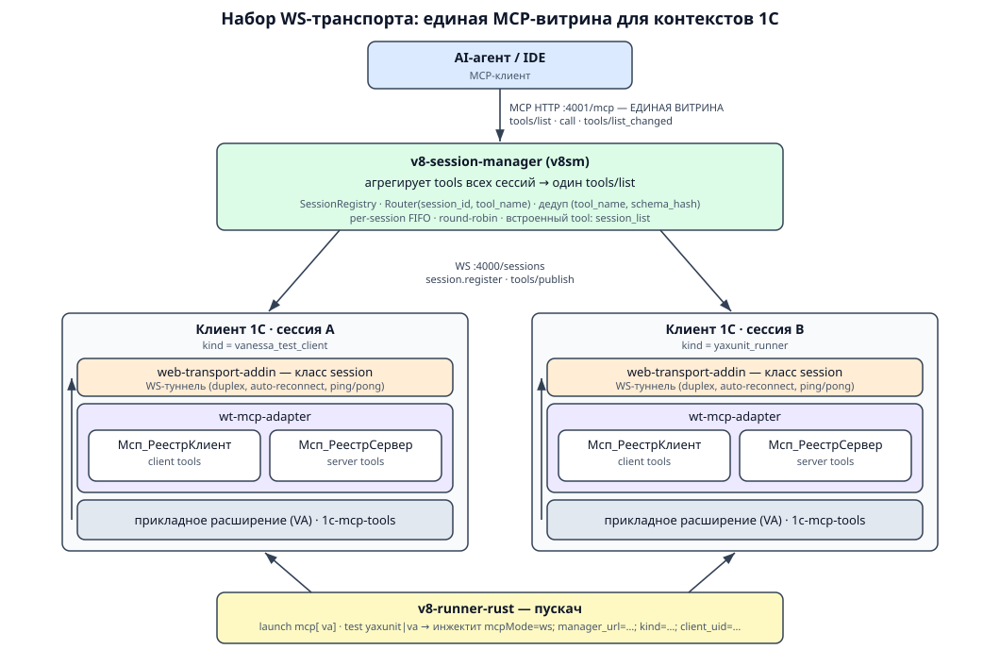

# Набор WS-транспорта: единая MCP-витрина для всех контекстов 1С

Deep-dive к разделу [«MCP-витрина менеджера сессий»](./mcp.md#mcp-витрина-менеджера-сессий-v8-session-manager)
в [mcp.md](./mcp.md). Здесь описан набор из пяти форков, которые вместе дают
агенту **одну точку входа** (одну MCP-витрину) к инструментам, живущим внутри
запущенных клиентов 1С — в любом их контексте (клиентском и серверном).

## Зачем

Раньше каждый 1С-клиент, желающий отдать агенту свои tools, поднимал отдельный
HTTP-MCP-сервер на отдельный порт (`runMcp`-режим). Это не масштабируется:
координация портов вручную, по серверу на клиента, нет общего реестра сессий.

Набор решает это так: клиенты 1С подключаются по WebSocket к менеджеру сессий,
публикуют свои tools, а менеджер агрегирует их в **одну** MCP-витрину на одном
HTTP-эндпоинте. Сколько бы клиентов ни было запущено — для агента это один сервер.

## Компоненты

| Репозиторий (форк) | Роль в наборе |
|--------------------|---------------|
| [`v8-runner-rust`](https://github.com/SteelMorgan/v8-runner-rust) | **Пускач.** Rust CLI, запускающий клиент 1С / тест-менеджер / тест-клиент и инжектящий в них параметры WS-подключения к менеджеру. |
| [`web-transport-addin`](https://github.com/alkoleft/web-transport-addin) | **Транспорт.** Native-API внешняя компонента (`WebTransportAddIn`); форк добавил класс `session` — дуплексный WS-туннель до менеджера, переносящий MCP JSON-RPC. |
| [`wt-mcp-adapter`](https://github.com/SteelMorgan/wt-mcp-adapter) | **Адаптер.** BSL-расширение 1С: реестр инструментов, сборка каталога, `session.register`. Точка, куда прикладные расширения регают свои tools. Форк `1c-neurofish/onec-client-mcp-devkit` (форк SteelMorgan переименован в `wt-mcp-adapter`). |
| [`1c-mcp-tools`](https://github.com/SteelMorgan/1c-mcp-tools) | **Набор готовых mcp-tools.** Расширение-провайдер (`MCP_Сервер`) с инструментами (метаданные и др.) и точкой расширения для своих tools. Самостоятельный проект; код заимствован у [В. Харина](https://github.com/vladimir-kharin/1c_mcp) и [В. Ли](https://github.com/RooLee10/1c-mcp-tools), переработан под `wt-mcp-adapter`. |
| [`v8-session-manager`](https://github.com/1c-neurofish/v8-session-manager) | **Менеджер сессий (`v8sm`).** Однобинарный агрегатор: собирает tools всех клиентов и отдаёт единую MCP-витрину агенту. |

### 1. `v8-runner-rust` — пускач с пробросом WS-канала

Rust CLI, запускающий процессы 1С и задающий им транспорт до менеджера. Один и тот
же механизм проброса работает для трёх типов клиента; тип фиксируется полем `kind`:

| Подкоманда | Что запускает | `kind` |
|------------|---------------|--------|
| `launch mcp` | клиент 1С (`1cv8c`) с MCP-режимом | `v8_runner_client` |
| `launch mcp va` | тест-**менеджер** Vanessa Automation (`/TESTMANAGER`) | `vanessa_test_client` |
| `test yaxunit …` | тест-**клиент** YAxUnit | `yaxunit_runner` |
| `test va …` | тест-**клиент** Vanessa Automation (player) | `vanessa_test_client` |

Проброс WS-канала настраивается ключом `tools.wt_mcp_adapter` (`transport` =
`auto` | `ws` | `mcp`). В режиме `auto` раннер за ~200 мс TCP-пробит `manager_url`
(по умолчанию `ws://127.0.0.1:4000/sessions`) и при успехе дописывает в строку
запуска клиента:

```
/C"mcpMode=ws;manager_url=ws://127.0.0.1:4000/sessions;client_uid=<UUID>;kind=<KIND>;corr_id=<...>"
```

Если менеджер недоступен — падает в локальный HTTP-MCP (`runMcp`, legacy). Сам
менеджер раннер **не запускает** — только подключает к нему клиента.

### 2. `web-transport-addin` — WS-транспорт (транспорт-only)

Внешняя компонента на Rust (`WebTransportAddIn`, Native API). Классы: `ws`, `http`,
`mcp` и добавленный форком **`session`** — сессионный WS-туннель до менеджера поверх
`tokio_tungstenite`: полный duplex, авто-reconnect (экспоненциальный backoff),
WS Ping/Pong. Туннель переносит JSON-RPC-нагрузку инструментов между клиентом 1С и
менеджером.

Вызывается из BSL адаптера (`Мсп_ТранспортСессионКлиент`) методом:

```bsl
Компонента.ЗапуститьСессионнуюИнтеграцию(URL, ClientUID, Kind, CorrelationID);
```

События в 1С: `WS_RECONNECT_STATE` (`connecting`/`connected`/`disconnected`/`give_up`),
`WS_INCOMING`. После рефакторинга «transport-only» (ADR-0005) вся прикладная логика
вынесена в BSL/адаптер — ВК осталась чистым проводом. Поэтому это **парный форк** с
`wt-mcp-adapter`, а не «встроенная внутрь него» библиотека.

### 3. `wt-mcp-adapter` — адаптер и реестр tools

BSL-расширение (`exts/wt-mcp-adapter`), реализующее MCP-адаптер поверх ВК. Здесь —
**витрина для прикладных расширений**: любое прикладное расширение (например Vanessa
Automation) регистрирует свои инструменты через API реестра:

```bsl
Описание = Мсп_РеестрКлиент.НовыйОписаниеИнструмента();
Описание.Имя          = "…";
Описание.Описание     = "…";
Описание.СхемаПараметров = …;      // JSON-schema входных параметров
Описание.Обработчик   = Новый ОписаниеОповещения("…", …);
Мсп_РеестрКлиент.ЗарегистрироватьИнструмент(Описание);
```

**Клиентский и серверный контекст — это два параллельных реестра** в одном
расширении:

- `Мсп_РеестрКлиент` — инструменты, исполняемые в **клиентском** контексте 1С;
- `Мсп_РеестрСервер` — инструменты, исполняемые в **серверном** контексте.

Оба имеют `ЗарегистрироватьИнструмент(...)`. Поэтому одно прикладное расширение
описывает и клиентские, и серверные tools сразу. При событии
`WS_RECONNECT_STATE = connected` модуль `Мсп_ТранспортСессионКлиент` сам собирает
каталог (`tools`/`resources`/`prompts` в snake_case) и шлёт менеджеру
`session.register` — без участия Rust-ВК на прикладном уровне.

### 4. `1c-mcp-tools` — готовый набор mcp-tools

Самостоятельный проект `SteelMorgan/1c-mcp-tools`: основной код заимствован у
[Владимира Харина](https://github.com/vladimir-kharin/1c_mcp) и его форка
[Вадима Ли (RooLee10)](https://github.com/RooLee10/1c-mcp-tools), затем существенно
переработан под работу с `wt-mcp-adapter` (логика и архитектура изменены, из-за чего
это уже отдельный проект). Поставляет готовое 1С-расширение-провайдер (`MCP_Сервер`)
с инструментами платформы, например:

- `list_metadata_objects` — список объектов метаданных (`metaType`, `nameMask`, `maxItems`);
- `get_metadata_structure` — структура объекта (`metaType`, `name`);
- ресурс `1csyntax` (`file://resource/syntax_1c.txt`) — справка по встроенному языку.

Точка расширения для своих tools — обработчик с `ДобавитьИнструменты(Инструменты)` /
`ВыполнитьИнструмент(ИмяИнструмента, Аргументы)`. Маркерная подсистема
`mcp_Мсп_Провайдеры` служит хуком обнаружения: адаптер/менеджер сканирует конфигурации
на эту подсистему и подхватывает найденных провайдеров tools. (У расширения есть и
самостоятельный HTTP-путь — `HTTPСервис mcp_APIBackend` на `/hs/mcp/rpc` + Python-прокси, —
но в наборе оно используется как поставщик tools для витрины.)

### 5. `v8-session-manager` (`v8sm`) — менеджер и единая витрина

Однобинарный агрегатор клиентских MCP-сессий 1С. Два порта:

- **WS `:4000/sessions`** — вход для клиентов 1С (`mcpMode=ws`, `manager_url=…`);
- **MCP HTTP `:4001/mcp`** — единая витрина для агента (streamable HTTP).

Клиент шлёт `session.register` + `tools/publish` по WS → `SessionRegistry` регистрирует
инструменты → витрина публикует агрегированный `tools/list`. Имена публикуются
«голыми» (`published_name == tool_name`, Naming contract v2); дедупликация — по паре
`(tool_name, schema_hash)` (`kind` в ключ не входит). Изменения состава рассылаются
через `tools/list_changed`.

Маршрутизация вызова (`router.rs`): резолв `(session_id, tool_name)`; при одинаковом
`(tool_name, schema_hash)` у нескольких сессий — round-robin между слотами; вызов
кладётся в per-session FIFO (`SessionDispatcher`) и уходит по WS в нужную сессию.
Единственный встроенный tool менеджера — `session_list` (read-only снимок реестра).

Идентификаторы реестра: `client_uid`, `kind`, `version`, `infobase_name`,
`ib_session_number` (`НомерСеанса()`), `host_id`, `generation`, `session_id`
(`== client_uid`), `prefix`.

## Как это работает

```
                     ┌──────────────────────────┐
                     │        AI-агент / IDE     │
                     └────────────┬─────────────┘
                       MCP HTTP :4001/mcp  (ЕДИНАЯ ВИТРИНА)
                                  │  tools/list · call · tools/list_changed
                     ┌────────────▼─────────────────────────────┐
                     │   v8-session-manager (v8sm)               │
                     │   SessionRegistry · Router(session_id,    │
                     │   tool_name) · session_list               │
                     └───┬───────────────────────────────────┬───┘
             WS :4000/sessions                       WS :4000/sessions
        session.register / tools/publish        session.register / tools/publish
                 │                                             │
   ┌─────────────▼──────────────┐               ┌──────────────▼─────────────┐
   │  Клиент 1С  (сессия A)      │               │  Клиент 1С  (сессия B)     │
   │  kind=vanessa_test_client   │               │  kind=yaxunit_runner       │
   │                             │               │                            │
   │  web-transport-addin        │               │  web-transport-addin       │
   │    класс session (WS-туннель)               │    класс session           │
   │        ▲                    │               │        ▲                   │
   │  wt-mcp-adapter             │               │  wt-mcp-adapter            │
   │   ├ Мсп_РеестрКлиент  (client tools)         │   ├ Мсп_РеестрКлиент       │
   │   └ Мсп_РеестрСервер  (server tools)         │   └ Мсп_РеестрСервер       │
   │        ▲                    │               │        ▲                   │
   │  прикладное расширение (VA) │               │  1c-mcp-tools (провайдер)  │
   └─────────────▲──────────────┘               └──────────────▲─────────────┘
                 │  launch/​test  +  mcpMode=ws;kind=…;client_uid=…
        ┌────────┴───────────────────────────────────────────┐
        │  v8-runner-rust  (пускач: launch mcp[ va] / test …) │
        └────────────────────────────────────────────────────┘
```

Схема в виде картинки (точная версия с русскими идентификаторами `Мсп_РеестрКлиент` /
`Мсп_РеестрСервер`, портами и деталями маршрутизации):



Растровая (обзорная) версия — [`assets/mcp-ws-transport-toolset.png`](./assets/mcp-ws-transport-toolset.png),
генерируется навыком `codex-image-gen`. Текущий PNG создан до переименования
`1c_mcp` → `1c-mcp-tools`; перегенерировать, когда доступен инструмент `image_generation`.

Поток по шагам:

1. **`v8-runner-rust`** запускает клиент 1С (обычный клиент, тест-менеджер VA или
   тест-клиент YAxUnit/VA) и инжектит в него `mcpMode=ws;manager_url=…;kind=…;client_uid=…`.
2. Внутри клиента адаптер **`wt-mcp-adapter`** через ВК **`web-transport-addin`** (класс
   `session`) открывает дуплексный WS-туннель к **`v8sm`**.
3. Прикладные расширения (VA и т.п.) и **`1c-mcp-tools`** регистрируют свои инструменты в
   реестрах адаптера — `Мсп_РеестрКлиент` (клиентские) и/или `Мсп_РеестрСервер`
   (серверные).
4. При подключении адаптер собирает каталог и шлёт `session.register` / `tools/publish`
   менеджеру.
5. **`v8sm`** агрегирует tools всех подключённых клиентов и публикует их одной
   MCP-витриной на `:4001/mcp`.
6. Агент вызывает tool на витрине → менеджер маршрутизирует по `(session_id, tool_name)`
   (round-robin между равнозначными слотами, per-session FIFO) → по WS-туннелю в нужный
   клиент → `wt-mcp-adapter` исполняет инструмент в клиентском или серверном контексте →
   результат возвращается тем же путём.

## Ключевая идея

Одно прикладное расширение = и клиентские, и серверные tools (два реестра адаптера).
Много клиентов = много сессий у менеджера. Но для агента это всегда **одна витрина** на
одном порту — маршрутизацию по сессиям и контекстам берёт на себя `v8sm`.

## Связанные компоненты

- [docs/info/mcp.md](./mcp.md) — обзор MCP-серверов и методология capability.
- [docs/info/mcp-bsl-debugger.md](./mcp-bsl-debugger.md) — отдельный MCP-отладчик BSL.
- [framework/skills/tool-usage/v8-runner/](../../framework/skills/tool-usage/v8-runner/) — навык по пускачу.
- [framework/skills/tool-usage/v8-session-manager/](../../framework/skills/tool-usage/v8-session-manager/) — навык по менеджеру сессий.
- [framework/capabilities/registry.yaml](../../framework/capabilities/registry.yaml) — реестр возможностей.
