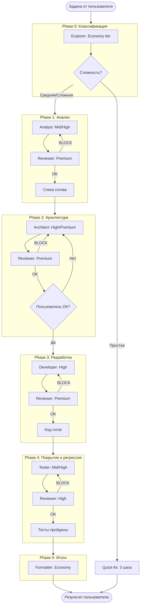

# Воркфлоу: Полный цикл разработки (Full Cycle)

> **ДЕТЕРМИНИРОВАННЫЙ** воркфлоу. Кросс-ревью на каждом шаге. Используется для задач средней и высокой сложности.

---

## Назначение

Полный цикл разработки — это жёстко структурированный процесс с обязательной проверкой артефактов на каждой фазе. Каждый выход одного агента проверяется следующим агентом (ревьюером) по чек-листу. Гарантирует качество и предсказуемость результата.

---

## Диаграмма процесса

---

## Фазы воркфлоу

### Phase 0: Классификация (Explorer → Economy)

| Элемент | Описание |
|---------|----------|
| **Вход** | Задача от пользователя |
| **Действие** | Explorer анализирует задачу, определяет сложность по decision tree |
| **Выход** | Классификация: простая / средняя / сложная |
| **Маршрутизация** | Простая → `quick-fix.md`; Средняя/Сложная → Phase 1 |

**Инструменты:** `navigate_symbol`, `get_call_graph`, `search_metadata`, `get_diagnostics`

---

### Phase 1: Анализ и спецификация (Analyst → Mid/High)

| Элемент | Описание |
|---------|----------|
| **Вход** | Задача + контекст проекта |
| **Действие** | Analyst создаёт спецификацию в формате MADR 4.0 + RFC 2119 |
| **Выход** | SPEC-документ (файл спецификации) |
| **Ревью** | Reviewer (Premium) проверяет спеку по чек-листу спецификации |
| **Итерации** | Максимум 3, затем эскалация пользователю |

**Чек-лист ревью:** [cross-review-policy.md](../rules/cross-review-policy.md) → Чек-лист спецификации

---

### Phase 2: Архитектура (Architect → High/Premium)

| Элемент | Описание |
|---------|----------|
| **Вход** | Утверждённая спецификация |
| **Действие** | Architect проектирует решение (Technical Design) |
| **Выход** | Technical Design (добавляется в спеку или отдельный документ) |
| **Ревью** | Reviewer (Premium) проверяет архитектуру по чек-листу |
| **STOP** | Ждём подтверждения пользователя перед Phase 3 |

**Важно:** Фаза блокируется до явного одобрения пользователем. Это точка контроля для архитектурных решений.

---

### Phase 3: Разработка (Developer → High)

| Элемент | Описание |
|---------|----------|
| **Вход** | Утверждённая спека + Technical Design |
| **Действие** | Developer пишет код по TDD: **сначала тесты** для MUST-сценариев из спеки, **затем** реализация до прохождения тестов |
| **Выход** | BSL-модули + unit-тесты (YaxUnit), все тесты проходят |
| **Ревью** | Reviewer (Premium) проверяет код + тесты по BSL-чек-листу |

**TDD-цикл внутри Phase 3:**
1. Написать тест для следующего MUST-сценария из спеки
2. Убедиться, что тест падает (`run_tests`)
3. Написать минимальную реализацию
4. Убедиться, что тест проходит (`run_tests`)
5. Рефакторинг при необходимости
6. Повторить для следующего сценария

**Правила:** См. [tdd-policy.md](../rules/tdd-policy.md), [mandatory-tools.md](../rules/mandatory-tools.md)

---

### Phase 4: Покрытие и регрессия (Tester → Mid/High)

| Элемент | Описание |
|---------|----------|
| **Вход** | Код + тесты из Phase 3 + тест-план из спеки |
| **Действие** | Tester проверяет покрытие тест-плана, дописывает недостающие тесты (edge-cases, интеграционные, регрессионные), запускает полный прогон |
| **Выход** | Полный набор тестов (unit + регрессия) + результаты прогона |
| **Ревью** | Reviewer (High) проверяет тесты по чек-листу тестов |

**Важно:** Phase 4 НЕ дублирует Phase 3. Developer пишет unit-тесты по TDD. Tester дополняет покрытие: edge-cases, негативные сценарии, интеграционные тесты, регрессия.

**Инструменты:** `run_tests`, `check_syntax`, `get_diagnostics`

---

### Phase 5: Итоги (Formatter → Economy)

| Элемент | Описание |
|---------|----------|
| **Вход** | Все артефакты (спека, код, тесты) |
| **Действие** | Финальное оформление, документация изменений |
| **Выход** | Готовый результат пользователю |

**Ревью:** Не требуется (форматирование, сводка).

---

## Передача артефактов между фазами

### Правила передачи

| От фазы | К фазе | Артефакт | Формат |
|---------|--------|-----------|--------|
| Phase 0 | Phase 1 / quick-fix | Классификация + контекст | Структурированный текст, ссылки на модули |
| Phase 1 | Phase 2 | SPEC-документ | Markdown, MADR 4.0 |
| Phase 2 | Phase 3 | SPEC + Technical Design | Markdown |
| Phase 3 | Phase 4 | BSL-модули, тесты | Файлы .bsl |
| Phase 4 | Phase 5 | Весь набор артефактов | Папка/task bundle |

### Обязательные поля в артефакте

- **Спецификация:** Context, Requirements (RFC 2119), Scope, Test Plan, Acceptance Criteria
- **Technical Design:** Компоненты, интерфейсы, разделение ответственности (пользователь/агент)
- **Код:** Путь к файлу, соответствие coding-standards
- **Тесты:** Связь с MUST-сценариями из спеки

### Каналы передачи

- **В рамках одной сессии:** Передача через контекст оркестратора
- **Между сессиями:** Хранение в `.tasks/task-[name]/` или в конфигурации проекта

---

## Обработка ошибок

### Ревью блокирует (BLOCK)

| Ситуация | Действие |
|----------|----------|
| Ревьюер поставил BLOCK | Автор артефакта исправляет по замечаниям |
| Итерация ≤ 3 | Повторная отправка на ревью |
| Итерация > 3 | **Эскалация пользователю.** Работа останавливается. Пользователь решает: исправить вручную, отменить, или снять BLOCK с обоснованием |

### Пользователь отклонил

| Точка отклонения | Действие |
|------------------|----------|
| Phase 2 (архитектура) | Architect перерабатывает дизайн с учётом комментариев пользователя. Возврат на ревью архитектуры. |
| Любая фаза | Пользователь может потребовать откат на предыдущую фазу. Контекст сохраняется. |

### Тесты не прошли

| Ситуация | Действие |
|----------|----------|
| `run_tests` вернул ошибки в Phase 3 | **Developer** анализирует причину: ошибка в тесте → исправить тест; ошибка в коде → исправить реализацию. Повторный прогон. |
| `run_tests` вернул ошибки в Phase 4 | **Tester** определяет причину: некорректный тест → исправить тест; ошибка в реализации → **вернуть Developer** с описанием проблемы (Tester НЕ правит код реализации). |
| Падение при `check_syntax` | Developer исправляет синтаксис. Обязательная проверка перед ревью. |
| Тесты не покрывают MUST из спеки | Ревьюер ставит BLOCK по чек-листу тестов. Tester дописывает тесты. |

### Capability недоступна

| Ситуация | Действие |
|----------|----------|
| MCP-инструмент недоступен | Агент фиксирует причину пропуска (см. mandatory-tools escape hatch). Продолжает с ограничениями или эскалирует пользователю. |

---

## Связанные ресурсы

| Ресурс | Связь |
|--------|-------|
| [quick-fix.md](./quick-fix.md) | Маршрут для простых задач |
| [orchestrator.md](./orchestrator.md) | Протокол оркестрации |
| [cross-review-policy.md](../rules/cross-review-policy.md) | Протокол ревью, чек-листы |
| [model-routing.md](../rules/model-routing.md) | Выбор tier для каждого агента |
| [docs/SPEC-001-framework-architecture.md](../../docs/SPEC-001-framework-architecture.md) | Общая архитектура |
