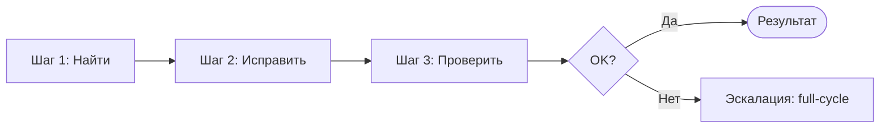

# Воркфлоу: Быстрое исправление (Quick Fix)

> **Три шага без кросс-ревью.** Для простых задач: исправление бага, мелкая правка, одна точка изменения.

---

## Назначение

Quick-fix — облегчённый воркфлоу для задач, не требующих полного цикла. Один агент (Developer) выполняет весь объём работы. Ревьюер не привлекается. Экономия времени и токенов.

---

## Когда использовать Quick-fix vs Full-cycle

| Критерий | Quick-fix | Full-cycle |
|----------|-----------|------------|
| **Объём изменений** | Один файл, < 20 строк | Несколько файлов, архитектурные решения |
| **Архитектурные решения** | Нет | Да |
| **Новые объекты метаданных** | Нет | Да (или возможно) |
| **Новые функции** | Нет | Да |
| **Тип задачи** | Исправление бага, рефакторинг переменной, точечная правка | Новая фича, интеграция, рефакторинг модуля |

### Краткая памятка

- **Quick-fix:** изменение в одном файле, менее 20 строк, без архитектурных решений, без новых фич
- **Full-cycle:** всё остальное

---

## Шаги воркфлоу

### Шаг 1: Найти (Explorer → Economy)

| Элемент | Описание |
|---------|----------|
| **Цель** | Найти релевантный код и понять текущее поведение |
| **Инструменты** | `navigate_symbol`, `get_call_graph`, `search_metadata` |
| **Выход** | Путь к модулю, понимание контекста, список затрагиваемых символов |

**Действия:**
- Использовать `navigate_symbol` для поиска определений и использований
- Использовать `get_call_graph` для понимания зависимостей
- Убедиться, что изменение локализовано

---

### Шаг 2: Исправить (Developer → Mid)

| Элемент | Описание |
|---------|----------|
| **Цель** | Внести изменение |
| **Правила** | Следовать BSL coding standards ([coding-standards.md](../skills/bsl-practices/coding-standards.md), [anti-patterns.md](../skills/bsl-practices/anti-patterns.md)) |
| **Выход** | Изменённый BSL-модуль |

**Действия:**
- Внести минимально необходимое изменение
- Не добавлять «улучшения» за рамками задачи
- Сохранить стиль кода проекта

---

### Шаг 3: Проверить (Developer → Mid)

| Элемент | Описание |
|---------|----------|
| **Цель** | Убедиться, что изменение не сломало систему |
| **Инструменты** | `check_syntax`, `run_tests`, `get_diagnostics` |
| **Выход** | Подтверждение: синтаксис OK, тесты пройдены (если есть), диагностик нет |

**Действия:**
1. **check_syntax** — обязательно для изменённого модуля
2. **run_tests** — если есть тесты для затронутого модуля
3. **get_diagnostics** — проверить отсутствие ошибок LSP

---

## Эскалация на Full-cycle

Если quick-fix не справляется — перейти на [full-cycle.md](./full-cycle.md).

### Признаки необходимости эскалации

| Ситуация | Действие |
|----------|----------|
| Тесты падают после изменения | Исправить или эскалировать на full-cycle (Tester + Reviewer) |
| Ошибка затрагивает несколько модулей | Full-cycle |
| Требуется изменение архитектуры | Full-cycle |
| Пользователь запросил ревью | Full-cycle |
| Изменение выросло > 20 строк | Рассмотреть full-cycle |

### Протокол эскалации

1. Зафиксировать текущее состояние (что сделано, что не удалось)
2. Передать контекст оркестратору
3. Запустить full-cycle с Phase 1 (Analyst), если контекста недостаточно, или с Phase 3 (Developer), если спека уже есть

---

## Диаграмма

---

## Связанные ресурсы

| Ресурс | Связь |
|--------|-------|
| [full-cycle.md](./full-cycle.md) | Воркфлоу при эскалации |
| [orchestrator.md](./orchestrator.md) | Маршрутизация quick-fix vs full-cycle |
| [syntax-checking.md](../skills/tool-usage/syntax-checking.md) | Навык проверки синтаксиса |
| [test-execution.md](../skills/tool-usage/test-execution.md) | Навык запуска тестов |
