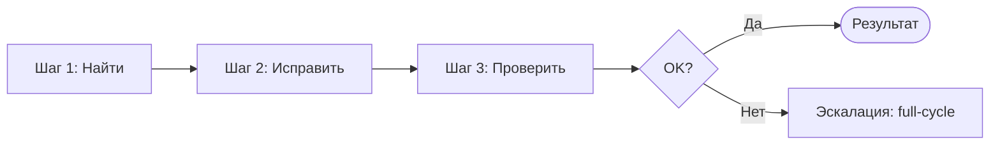

# Workflow: Quick Fix

> **Three steps without cross-review.** For simple tasks: bug fix, minor tweak, single point of change.

---

## Purpose

Quick-fix is a lightweight workflow for tasks that do not require the full cycle. One agent (Developer) carries out the entire scope of work. No reviewer is involved. Saves time and tokens.

---

## When to use Quick-fix vs Full-cycle

| Criterion | Quick-fix | Full-cycle |
|----------|-----------|------------|
| **Scope of changes** | One file, < 20 lines | Multiple files, architectural decisions |
| **Architectural decisions** | No | Yes |
| **New metadata objects** | No | Yes (or possible) |
| **New features** | No | Yes |
| **Task type** | Bug fix, variable refactor, targeted tweak | New feature, integration, module refactor |

### Quick reminder

- **Quick-fix:** change within one file, under 20 lines, no architectural decisions, no new features
- **Full-cycle:** everything else

---

## Workflow steps

### Step 1: Find (Explorer → Economy)

| Element | Description |
|---------|-------------|
| **Goal** | Locate the relevant code and understand the current behavior |
| **Tools** | `navigate_symbol`, `get_call_graph`, `list_metadata_objects`, `get_metadata_structure` |
| **Output** | Path to the module, understanding of the context, list of touched symbols |

**Actions:**
- Use `navigate_symbol` to find definitions and usages
- Use `get_call_graph` to understand dependencies
- Ensure the change is localized

---

### Step 2: Fix (Developer → Mid)

| Element | Description |
|---------|-------------|
| **Goal** | Make the change |
| **Rules** | Follow BSL coding standards ([coding-standards.md](../skills/bsl-practices/coding-standards.md)) |
| **Output** | Updated BSL module |

**Actions:**
- Apply the minimal necessary change
- Do not add "improvements" beyond the task
- Preserve the project code style

---

### Step 3: Verify (Developer → Mid)

| Element | Description |
|---------|-------------|
| **Goal** | Confirm that the change did not break the system |
| **Tools** | `check_syntax`, `run_tests`, `get_diagnostics` |
| **Output** | Confirmation: syntax OK, tests passed (if available), no diagnostics |

**Actions:**
1. **check_syntax** — required for the modified module
2. **run_tests** — if there are tests for the affected module
3. **get_diagnostics** — verify no LSP errors

---

## Escalation to Full-cycle

If quick-fix is insufficient — switch to [full-cycle.md](./full-cycle.md).

### Signs that escalation is needed

| Situation | Action |
|----------|--------|
| Tests fail after the change | Fix or escalate to full-cycle (Tester + Reviewer) |
| The bug touches multiple modules | Full-cycle |
| Architectural change is required | Full-cycle |
| User requested a review | Full-cycle |
| Change grew beyond 20 lines | Consider full-cycle |

### Escalation protocol

1. Record the current state (what was done, what failed)
2. Pass the context to the orchestrator
3. Start full-cycle with Phase 1 (Analyst) if context is insufficient, or Phase 3 (Developer) if the spec already exists

---

## Diagram

---

## Related resources

| Resource | Relation |
|--------|-------|
| [full-cycle.md](./full-cycle.md) | Workflow for escalation |
| [orchestrator.md](./orchestrator.md) | Routing quick-fix vs full-cycle |
| [syntax-checking.md](../skills/tool-usage/syntax-checking.md) | Syntax checking skill |
| [test-execution.md](../skills/tool-usage/test-execution.md) | Test execution skill |

---
depends_on:
  - framework/workflows/full-cycle.md
  - framework/subagents/explorer.md
  - framework/subagents/developer-code.md
  - framework/skills/bsl-practices/coding-standards/SKILL.md
  - framework/skills/tool-usage/code-analysis/syntax-checking/SKILL.md
  - framework/skills/tool-usage/code-analysis/test-execution/SKILL.md
---
